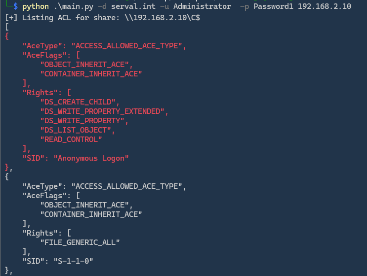

# SMBShareInspector

This Python script is designed to list SMB shares and their Access Control Lists (ACLs) on a remote system. It supports authentication using username/password, NTLM hash, or Kerberos. The script uses the `aiosmb` library for SMB interactions and `DescribeSDDL` for listing ACLs.

## Features
- List SMB shares on a remote machine.
- List and display ACLs for each share.
- Highlight specific users in ACLs, such as "everyone", "anonymous", etc.
- Supports authentication with username/password, NTLM hash, or Kerberos.

## Requirements
- Python 3.x
- `aiosmb` library
- `DescribeSDDL` library

## Installation

1. Clone the repository:
```bash
git clone https://github.com/CobblePot59/SMBShareInspector.git
cd SMBShareInspector
```

2. Install dependencies:
```bash
pip install -r requirements.txt
```

## Usage
```bash
python3 main.py <ip_address> -d <domain> -u <username> -p <password>
```

### Arguments:
- `ip_address`: Target IP address or hostname of the SMB server.
- `-d, --domain`: The domain name.
- `-u, --username`: The username for authentication (optional if using Kerberos).
- `-p, --password`: The password for authentication (required if not using NTLM hash).
- `-H, --nthash`: NTLM hash for authentication (optional).
- `-k, --kerberos`: Use Kerberos authentication (optional).

### Example:
